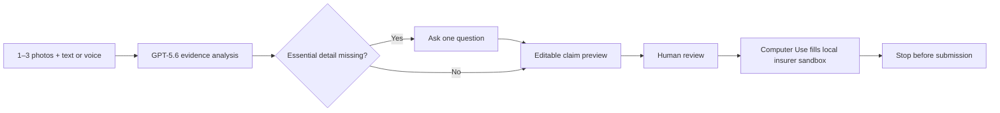

# ClaimDone

ClaimDone turns one to three accident photos and a short written or spoken description into a reviewed insurance-claim handoff. It is a focused OpenAI Build Week demo for a stressful, repetitive task: translating unstructured accident evidence into the fields an insurer needs.

> **Sandbox only:** use synthetic data. ClaimDone never submits a real insurance claim or contacts a real insurer.

## Demo highlights

- **Multimodal claim agent:** GPT-5.6 reviews every supplied photo and the customer statement, then prepares a structured claim or asks for one essential detail.
- **Observable agent activity:** `/demo` shows validated evidence checks and decisions without exposing private chain-of-thought.
- **Human review:** the customer can complete missing fields and edit the claim before any portal handoff.
- **Restricted Computer Use:** GPT-5.4-mini navigates a local synthetic insurer portal, fills only approved values, verifies them, and stops before submission.
- **Visible replay:** the presenter view replays screenshots captured during the isolated browser run.

## How it works



ClaimDone does not persist photos, audio, claim data, or captured screenshots. Its local state stays in memory, and reloading the app resets the flow. Live analysis sends evidence to the configured OpenAI API as described under [Safety boundaries](#safety-boundaries).

## Run locally

### Requirements

- Node.js 24 (`.nvmrc` pins `24.14.0`; supported range is `>=24.14.0 <25`)
- npm 11
- An OpenAI API key and internet access for the live AI flows
- Google Chrome for the Computer Use portal handoff

`playwright-core` controls a locally installed Chrome browser and does not download one.

### Setup

```bash
git clone https://github.com/janikdotzel/claimdone.git
cd claimdone
npm ci
cp .env.example .env.local
```

Configure `.env.local`:

| Variable | Required | Purpose |
| --- | --- | --- |
| `OPENAI_API_KEY` | For live AI flows | Server-only key used for image analysis, voice transcription, and Computer Use. |
| `CLAIMDONE_SHOW_COMPUTER_USE_BROWSER` | No | Set to `true` to show the isolated Chrome window during Computer Use. Defaults to `false`. |

Keep the API key only in `.env.local`. That file is ignored by Git and its values stay out of the client bundle.

The optional browser flag is still implemented. It changes the isolated Chrome run from headless to visible and adds a short presentation delay. The captured replay in `/demo` is available either way.

Start the app:

```bash
npm run dev
```

Open:

- [http://127.0.0.1:3001](http://127.0.0.1:3001) for the customer view
- [http://127.0.0.1:3001/demo](http://127.0.0.1:3001/demo) for the presenter view

The port is intentionally fixed. Computer Use permits only the three local sandbox pages under `http://127.0.0.1:3001/portal/sandbox`; changing the port prevents the portal handoff.

## Quick judge walkthrough

Both views start with three synthetic accident photos and a synthetic description, so the demo is ready immediately.

1. Open `/demo` and introduce the staged evidence. The agent activity history is intentionally empty before analysis starts.
2. Select **Analyze accident** and follow the validated photo, statement, and completeness checks in the presenter panel.
3. If the agent asks one question, answer it and continue. If the preview contains a required field, complete it. Then review or edit the claim.
4. Select **Run Computer Use in insurer sandbox**. The agent opens the Demo Mutual home page, follows the two permitted links, fills the reviewed values, and verifies the form.
5. Review the captured browser replay and completed sandbox form. The run stops before submission.

The bundled photos live in [`public/images/claim-flow`](public/images/claim-flow). Replace them through the upload control to test any one-to-three-photo combination, but continue to use synthetic data.

## Architecture and AI models

| Area | Implementation |
| --- | --- |
| Application | Next.js 16, React 19, TypeScript, CSS Modules |
| Claim analysis | `gpt-5.6` with text and image input |
| Voice transcription | `gpt-4o-mini-transcribe` |
| Portal handoff | `gpt-5.4-mini` Computer Use with `playwright-core` |
| Validation | Strict Zod schemas for provider, API, activity, and handoff output |
| State | Browser and server memory only; no database or persistence |

The main entry points are `/` for the customer flow, `/demo` for presenter-only observability, and `/portal/sandbox` for the synthetic insurer portal. The API exposes one analysis path and one restricted portal-handoff path, with demo variants that also return observable activity or replay frames.

## Safety boundaries

- Evidence sent for live analysis is processed through the configured OpenAI API; use synthetic inputs only.
- Computer Use may visit only three exact local routes and click only **View claims**, followed by **Start a motor claim**.
- It may fill only Damage, Date and time, Location, What happened, and Attached photos using the reviewed claim values.
- Arbitrary navigation, other clicks, downloads, uploads, popups, and submit actions are blocked.
- The server verifies every field before reporting success; unexpected actions, timeouts, and action limits stop the run.
- The sandbox has no submit control and cannot send data to an insurer.

### Input limits

- Photos: 1–3 JPG or PNG files, up to 8 MB each
- Description: 1–1,500 characters
- Voice memo: M4A, MP3, WAV, or WebM, up to 60 seconds and 10 MB in the customer flow
- Missing information: at most one follow-up question

## Verify the project

```bash
npm run lint
npm run typecheck
npm test
npm run build
```

The automated tests use controlled provider and browser doubles. They do not need an API key, make live OpenAI requests, or launch Chrome.

To run the production build locally:

```bash
npm run build
npm run start
```

## Built with Codex

Codex helped turn a production-oriented prototype into this focused demo, implement the customer and presenter experiences, build the restricted Computer Use handoff, review the responsive UI, and verify the complete flow.

The demo narrative, build provenance, official deadline, and remaining submission checklist live in [`HACKATHON_SUBMISSION.md`](HACKATHON_SUBMISSION.md).

## Scope

ClaimDone is a local hackathon demonstration, not a production insurance system. It intentionally has no authentication, accounts, database, persistence, real insurer integration, arbitrary portal automation, or claim submission.

## License

ClaimDone is available under the [MIT License](LICENSE).
