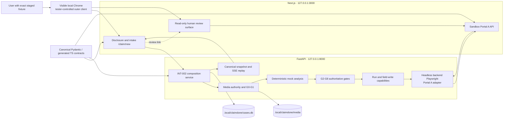

# ClaimDone architecture

## Document status

This document describes the deterministic V1 through INT-002. The acceptance scope is the exact
fixture `claimdone-int002-main-v1`, Portal A, and a final verified review without human approval or
receipt. INT-001 remains historical evidence; its former `verifying` boundary is no longer the
current V1 composition.

This architecture does not claim live-provider quality, Portal B acceptance, G11 release readiness,
submission, hosting, or production safety.

## Runtime composition



FastAPI owns case state and version, immutable gates, clarification identity, provider audit truth,
run authority, verification attempts, and the final snapshot. The frontend performs local preflight
only and advances solely from a contract-valid, case-bound server response. The portal is a separate
server-owned loopback surface; its rendered values are read back rather than trusted from UI flags.
The visible Chrome window is the tester-controlled outer client for the product flow and optional
read-only review. It is distinct from the headless Playwright adapter that FastAPI invokes for
bounded Portal A writes and verification captures.

## Canonical INT-002 sequence

```mermaid
sequenceDiagram
    actor U as User
    participant C as Visible local Chrome
    participant W as Next.js product UI
    participant A as FastAPI INT-002 service
    participant G as Deterministic gates
    participant B as Headless Portal A adapter
    participant P as Portal A

    U->>C: Disclosure, exact 3 PNGs, retain x3, statement, consents
    C->>W: Browser events and multipart request
    W->>A: POST /api/cases
    A-->>W: created v1
    W->>A: POST /api/cases/{id}/intake, expectedVersion 1
    A->>G: G0-G5
    G-->>A: one incident_time clarification
    A-->>W: awaiting_clarification v4
    U->>W: 14:30:00
    W->>A: POST clarification answer, expectedVersion 4
    A->>G: rebuild and rerun authoritative packet checks
    A-->>W: ready_to_fill v5
    W->>A: POST /api/cases/{id}/run, expectedVersion 5
    A->>G: G6 tool authority
    A->>G: read-only G7 preflight; no gate or authority mutation
    G-->>A: proposed fields and attachments authorized
    A->>B: execute only the preflight-authorized operation
    B->>P: bounded field and attachment writes; stop at review
    B->>P: read reviewed portal checkpoint
    A->>G: atomic G7 finalization binds the reviewed checkpoint
    G-->>A: G7 pass; case enters verifying
    A->>B: first fresh verification capture, portal v3
    B-->>A: intended incident_time mismatch
    A->>G: G8 remains blocked
    A->>B: one authorized incident_time repair, portal v3 to v4
    A->>B: second fresh rendered-value read
    B-->>A: exact match
    A->>G: G8 pass
    A-->>W: review v9, two attempts, no receipt
    W-->>U: verified Portal A review; human boundary preserved
```

The four browser-observed mutation responses are:

| Mutation | Required state | Required version |
| --- | --- | ---: |
| Create | `created` | 1 |
| Intake | `awaiting_clarification` | 4 |
| Answer | `ready_to_fill` | 5 |
| Run | `review` | 9 |

Intermediate server mutations v2, v3, v6, v7, and v8 are internal recovery checkpoints. Public
mutation responses intentionally expose only the four stable authority boundaries above.

## Gate order and authority

```text
exact fixture and server-owned v1
  -> G0 intake
  -> G1 privacy
  -> deterministic mock extraction event
  -> G2 strict output contract
  -> G3 safety and scope
  -> G4 evidence and provenance
  -> G5 completeness
  -> exactly one version-bound clarification
  -> packet rebuild and ready_to_fill v5
  -> G6 tool and loopback authority
  -> read-only G7 preflight of exact fields and attachments
  -> bounded Portal A writes; stop at portal review
  -> atomic G7 finalization bound to the reviewed checkpoint
  -> first fresh verification capture: one incident_time mismatch
  -> one narrow repair
  -> second fresh read: exact match
  -> G8 verification
  -> review v9; no approval and no receipt
```

Every gate decision is immutable. A model, mock, browser, portal, UI, eval, or human assertion may
add a block but cannot clear or weaken a deterministic failure.

## Component status

| Component | V1 responsibility | Status |
| --- | --- | --- |
| `apps/web/src/features/intake/` | Disclosure, exact intake, clarification, auto-run, review evidence | Composed |
| `apps/web/src/features/sandbox/` | Portal A state, controlled writes, rendered values, read-only review | Composed |
| `services/api/.../int002/` | Exact V1 orchestration and recovery across v1-v9 | Composed |
| `services/api/.../media/` | G0/G1, safe names, case-bound media, cleanup | Authoritative |
| `services/api/.../gates/` | G2-G8 deterministic decisions | Authoritative |
| `services/api/.../authority/` | Agent run capability and human-only approval boundary | Authoritative |
| `services/api/.../computer_use/` | Closed policy and headless backend Playwright adapter | Portal A V1 path |
| `services/api/.../workflow/` | Snapshot assembly and redacted SSE replay | Composed |
| `contracts/` | Only canonical cross-runtime contracts | Authoritative |
| `evals/` | Deterministic regression evidence; never production authority | EVAL-002 implemented |
| `docs/` | V1 test guide, evidence, risks, and historical record | Current through INT-002 |

## Trust boundaries

### Fixture and media

INT-002 accepts only the three manifest-bound PNGs, the exact normalized statement, all three
consents, and `retain` for every image. G0/G1 execute before analysis authority. Media is stored
under opaque server-owned names and removed by case cleanup or `make reset`. Public responses and
workflow events do not expose storage handles or raw bytes.

### Mock and provider boundary

The V1 analysis is deterministic and provider-free. It persists one redacted `provider_call` event
with `providerMode=mock` to exercise the same audit contract; the external provider call count is
zero. No OpenAI key is needed or read by the accepted path. A future live response would remain
untrusted input to the same strict contracts and gates.

### Browser and portal boundary

The accepted runtime constructs `PlaywrightSemanticPortalBrowser` for the exact loopback portal
origin. Policy validates the closed tool, URL, method, state, capability, field, and attachment set.
Portal content cannot authorize navigation or writes. The local policy is defense in depth, not an
independent OS/container network sandbox. This headless backend adapter is not the visible Chrome
window used by the tester: outer-browser interaction submits product requests and may display the
read-only review, while portal mutation and verification remain server-authorized adapter work.

### Human approval boundary

The final V1 case is `review`, not `human_approved`. The plan has `agentCanSubmit=false`; the Portal
A control is disabled for the agent; no receipt row or receipt projection exists. Negative authority
tests cover wrong role, invalid/reused capability, invalid state, and receipt-before-approval. The
V1 browser flow deliberately does not execute a human approval.

### Persistence, recovery, and SSE

SQLite commits every authority-bearing mutation atomically with its audit projection. Optimistic
versions reject stale requests. Intake, answer, portal run, and verification paths resolve bounded
uncertain commits without replaying unauthorized writes. SSE replays persisted, redacted workflow
events by database-owned cursor. After request-body replay, the middleware delegates to the real
ASGI receive channel so an open stream does not monopolize subsequent requests.

## Contract flow

```text
Pydantic contract models
  -> contracts/generated/claimdone.schema.json
  -> contracts/generated/claimdone.ts
  -> validated Python and TypeScript consumers
```

Unknown fields and coercion are rejected, validated models are immutable, and cross-runtime
consumers must not create local lookalike contracts.

## Eval and release separation

`make eval-deterministic` runs the versioned twelve-case regression set without a live model. It
checks schema, provenance, forbidden facts, required fields, safety blocks, tools, portal values,
mismatch/repair, approval, and receipt boundaries. Eval code cannot alter production gates.

Model graders, Portal B reliability, broader security/performance work, human product testing, G11,
release, video, submission, and production remain outside INT-002. They require explicit user
feedback and a new goal.

## Verification sources

- [V1 test handoff](v1-test-handoff.md)
- [Normalized INT-002 acceptance](evidence/int002-v1-acceptance.json)
- [Command and historical verification record](verification-results.md)
- [Computer-use security boundary](computer-use-security.md)
