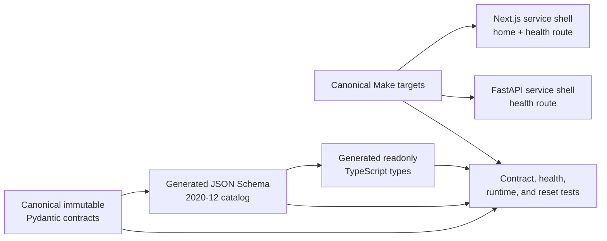
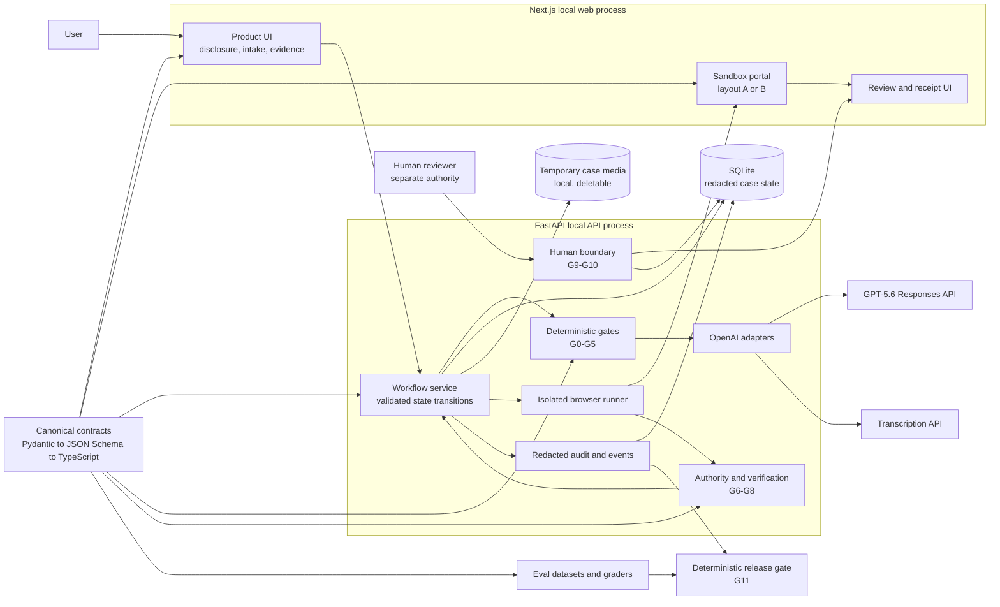

# ClaimDone architecture

## Document status

This is the DOC-001 architecture skeleton. It separates the code present on
the DOC-001 baseline from the target Build Week architecture. A box in a target
diagram is not evidence that the corresponding feature has been implemented
or tested.

## Implemented baseline



This baseline provides reproducible tooling and a shared vocabulary for cases,
states, provenance, gates, evals, and release decisions. It does not yet
execute the claim workflow.

## Target local architecture

Everything in this section beyond the implemented baseline is **planned**
until its implementation task is integrated and verified.



## Intended request and authority flow

The target happy path is:

```text
disclosure
  -> deterministic intake/privacy checks (G0-G1)
  -> constrained extraction and output/safety/provenance checks (G2-G4)
  -> deterministic required-field check and clarification (G5)
  -> bounded tool and portal writes (G6-G7)
  -> independent rendered-value comparison (G8)
  -> review
  -> separate human approval (G9)
  -> redacted sandbox receipt (G10)
```

At every step, a deterministic failure wins. Browser content, UI flags, model
output, model classifiers, verifiers, and model graders may add a block but may
not change an authoritative failure into a pass.

## Component responsibilities

| Component | Intended responsibility | DOC-001 baseline status |
| --- | --- | --- |
| `apps/web/` | Next.js product and sandbox surfaces | Service shell only |
| `services/api/` | FastAPI workflow, validated transitions, persistence, gates, adapters, and orchestration | Health shell plus canonical contract models |
| `contracts/` | The only canonical cross-runtime contract artifacts | Implemented |
| `fixtures/` | Staged synthetic, non-sensitive demo inputs | Directory exists; full demo fixtures planned |
| `evals/` | Datasets, graders, and reports; never production gate authority | Directory exists; implementation planned |
| `docs/` | Technical, verification, and submission documentation | Skeleton in progress |
| `scripts/` | Deterministic repository-local automation | Setup, verify, development, and cache reset implemented |

## Trust boundaries

### User input and media

The planned intake accepts only staged demo data. Media must pass count, size,
MIME, magic-byte, consent, and EXIF decisions before any model call. Temporary
copies must use safe names and be deleted by case reset or deletion. This media
pipeline is not present on the DOC-001 baseline.

### Model boundary

Model responses are untrusted inputs to strict contracts. GPT-5.6 is planned
to extract evidence-linked fields, propose a bounded plan, operate only the
local sandbox, and provide an additional verification signal. It receives no
authority to submit, approve, or weaken a deterministic decision.

### Browser boundary

The planned browser runner gets one isolated context per case, a local-origin
allowlist, action and time limits, and no access to human approval material.
Navigation, downloads, new windows, and actions outside the registry must be
blocked. The runner must terminate at portal state `review`.

### Human approval boundary

Agent and human credentials are planned to be structurally separate. The
agent role must receive `403` from approval APIs, and the one-time human token
must not appear in the agent browser, DOM, logs, or event stream. Receipts are
unavailable before human approval. These controls remain planned until AUTH-001
and its negative tests are integrated.

### Persistence and observability

The target state spine uses SQLite for redacted case, gate, portal, and audit
records. Raw media remains in temporary case directories, not in logs. Audit
events must avoid image bytes and complete identifying or insurance values.
Persistence and event storage are planned on this baseline.

## Contract flow

The canonical Python definitions live in
`services/api/src/claimdone_api/contracts/`. The generator produces:

```text
Pydantic contract models
  -> contracts/generated/claimdone.schema.json
  -> contracts/generated/claimdone.ts
  -> TypeScript consumers
```

Unknown fields and coercion are rejected, wire names use camelCase aliases,
and validated models are immutable. Consumers must import or generate from
these artifacts rather than create local lookalike types. Contract changes
require a version decision, regenerated artifacts, and the full contract test
suite.

## Eval and release separation

Production gate logic belongs with the workflow, not under `evals/`. The eval
area is intended to hold synthetic cases, deterministic graders, qualitative
model graders, and reports. Deterministic graders remain authoritative; model
graders may report only additional failures.

The target G11 release gate consumes verified test and eval artifacts plus
human checkpoints. It must produce a non-zero result with a reason code when a
required check is missing or failing. The contract for this decision exists;
the runner and its evidence do not yet exist.

## Planned integration sequence

1. Foundation and canonical contracts — implemented on the DOC-001 baseline.
2. Backend, media/gates, frontend, sandbox portal, initial evals, and this docs
   skeleton — parallel work, then one walking-skeleton integration.
3. AI, Computer Use, verifier, human authority, events, and deterministic eval
   runners — only after the walking skeleton is stable.
4. Full integration, security, accessibility, reliability, and external tests.
5. Final documentation, clean-checkout verification, G11 release decision, and
   human-authorized submission.

See [the implementation task list](../CLAIMDONE_IMPLEMENTATION_TASKS.md) for
the task-level dependencies and ownership.
