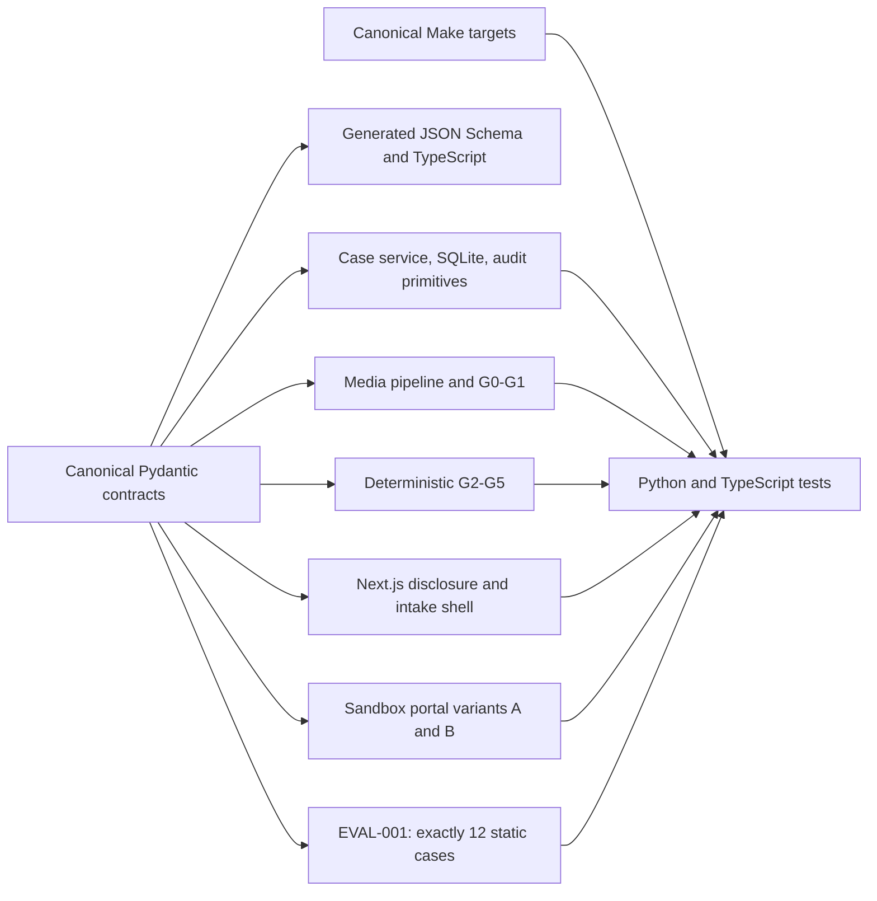
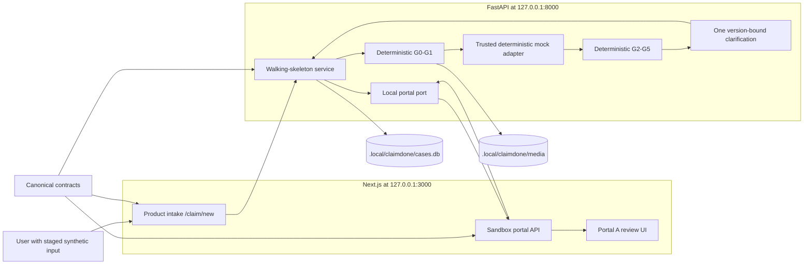

# ClaimDone architecture

## Document status

This document describes the Welle-1 code present on the INT-001 integration base and the frozen
INT-001 composition currently being integrated. A module marked implemented has source and focused
tests; the complete no-live-AI walkthrough remains **pending** until backend, web, dependency, and
quality branches are merged and verified from one commit.

## Welle-1 implementation map



The component implementations exist, but Welle 1 deliberately kept several boundaries
independent: the base FastAPI app did not compose every case/media route, the product intake did not
trust itself to advance backend state, and the portal was not yet driven by the backend. INT-001
exists to connect those boundaries without changing the canonical contracts ad hoc.

## INT-001 local architecture

INT-001 is a deterministic walking skeleton. It uses a mock extraction path and direct local HTTP
calls to the sandbox portal; it does not call an OpenAI model, a transcription service, or a browser
runner.



The backend owns case version, phase, gate history, clarification identity, and draft revision. The
frontend may run local preflight checks for fast feedback, but it advances only from a matching
server response. The server does not expose its private media storage name as a public case ID or
audit value.

## Frozen INT-001 request flow

The sequence below is the integration contract. Its final pass/fail evidence has not yet been
recorded.

```mermaid
sequenceDiagram
    actor U as User
    participant W as Product UI
    participant A as FastAPI workflow
    participant G as Deterministic gates
    participant M as Mock extraction
    participant P as Portal A API/UI

    U->>W: Disclosure, 3 images, text XOR WAV, consents, EXIF choices
    W->>A: POST /api/cases
    A-->>W: Created case ID and expected version
    W->>A: POST /api/cases/{caseId}/intake (multipart)
    A->>G: G0 then G1
    alt deterministic intake/privacy failure
        G-->>A: Immutable failed decision
        A-->>W: Error; no mock extraction or portal write
    else G0 and G1 pass
        A->>M: Approved local model-copy boundary
        M-->>A: Strict mock extraction with one required fact absent
        A->>G: G2, G3, G4, then G5
        G-->>A: One structured clarification
        A-->>W: Version-bound clarification response
        U->>W: One answer
        W->>A: POST /api/cases/{caseId}/clarifications/{clarificationId}/answer
        A->>G: Rebuild packet and rerun authoritative gates
        G-->>A: G0-G5 history passes
        A->>P: Reset/fill/review through local portal port
        P-->>A: Portal state review and rendered values
        A-->>W: Case verifying, portal review, verification pending
        W-->>U: Open /sandbox/A/cases/{caseId}
    end
```

The multipart intake sends a positive `expectedVersion`, checked before media/mock work; `images`
exactly three times; optional `statementText` XOR one PCM WAV `audio`; three consent booleans; and
`exifDecisions` exactly three times. The answer body is `{expectedVersion, answer}`. Successful
response envelopes bind a `requestId`, case snapshot, `draftRevision`, authoritative `gateHistory`,
phase, clarification, and portal result.

The success boundary is intentionally asymmetric:

- backend `CaseState`: `verifying`;
- portal state: `review`; and
- verification state: `pending`.

Portal review means the local form is ready to inspect. It does not mean G8 verification, backend
review, human approval, submission, or receipt. Advancing the backend case to `review` in INT-001
would falsely claim later-wave authority.

## Component responsibilities and status

| Component | Responsibility | Current status |
| --- | --- | --- |
| `apps/web/src/features/intake/` | Disclosure, local preflight, multipart client, clarification UI, stale-response protection | Welle-1 shell implemented; INT-001 server wiring in progress |
| `apps/web/src/features/sandbox/` | Local portal state, variants, validation, rendered values, reset | PORT-001 implemented; INT-001 delete/reset additions in progress |
| `services/api/.../cases/` | Case identity, optimistic versioning, state transitions, delete | BE-001 implemented; app composition in progress |
| `services/api/.../media/` | G0/G1, safe local names, EXIF review, deletable case media | MEDIA-001 implemented; persistent case-to-media binding in progress |
| `services/api/.../gates/` | Authoritative G2-G5 decisions and clarification boundary | GATE-001 implemented |
| INT-001 workflow package | Mock packet, one clarification, portal port, response snapshots | In progress; not yet verified in this document |
| `contracts/` | Only canonical cross-runtime contract artifacts | Implemented |
| `evals/` | Static datasets, future graders/reports; never production gate authority | EVAL-001 implemented and included in Make verification |
| `scripts/` | Exact runtime setup, canonical verification, safe reset | Implemented; INT-001 state path included |
| `docs/` | Technical status and reproducible evidence | Updated for integration; measured results remain pending |

## Authority and gate ordering

The INT-001 authoritative order is:

```text
disclosure and server-owned case version
  -> G0 intake
  -> G1 privacy
  -> deterministic mock extraction boundary
  -> G2 strict output contract
  -> G3 safety and scope
  -> G4 evidence and provenance
  -> G5 completeness
  -> one version-bound clarification
  -> rebuild and rerun authoritative gates
  -> local portal fill and portal review
  -> backend verifying with verification pending
```

A deterministic failure stops the flow. Model output, a mock adapter, browser content, portal data,
client preflight, model graders, and UI flags cannot change a failed gate into a pass. Later models
may add a block, never remove one.

G6-G8 are not silently simulated by the mock flow. G6 tool authority, G7 portal-write authority,
and independent G8 rendered-value verification are Welle-2 work. Likewise, G9/G10 human authority
and receipt redaction and G11 release readiness remain planned.

## Trust boundaries

### User input and media

Only staged synthetic demo data is permitted. G0 checks exact image count, byte limits, MIME and
magic bytes, statement mode, WAV duration, and consent before persistence. G1 requires an explicit
EXIF choice for every image and approval for model-ready copies. Media is stored under an opaque,
server-generated name and mapped persistently to the public case ID. Case deletion, backend demo
reset, and `make reset` are designed to remove ClaimDone-owned temporary media.

### Mock and future model boundary

The INT-001 mock is deterministic and server-controlled, but its output still passes through G2-G5
instead of bypassing them. Future model responses remain untrusted input to the same strict
contracts. No model receives authority to submit, approve, or weaken a deterministic decision.

### Portal boundary

INT-001 calls only the loopback Next.js portal origin. Portal state is independently server-owned;
the backend receives a returned portal snapshot rather than trusting a browser flag. INT-001 stops
at portal `review`. Isolated adaptive Computer Use, tool allowlists, and independent comparison are
planned and must not be inferred from this direct local mock path.

### Human approval boundary

Agent/human credential separation, a one-time human action, HTTP `403` for agent approval attempts,
and receipt withholding are AUTH-001 work. No INT-001 response represents approval or submission.

### Persistence and observability

The default local state is `.local/claimdone/cases.db` plus `.local/claimdone/media/`. Case APIs use
optimistic version checks. Audit records are intended to contain stable IDs and safe summaries, not
raw image bytes, private media storage names, or full identifying/insurance values.

## Contract flow

Canonical Python definitions live in `services/api/src/claimdone_api/contracts/`:

```text
Pydantic contract models
  -> contracts/generated/claimdone.schema.json
  -> contracts/generated/claimdone.ts
  -> TypeScript consumers
```

Unknown fields and coercion are rejected, wire names use camelCase aliases, and validated models
are immutable. Consumers must import or generate from these artifacts instead of creating local
lookalikes. Contract changes require an explicit version decision, regenerated artifacts, and the
full canonical checks.

## Eval and release separation

Production gate logic belongs with the workflow, never under `evals/`. EVAL-001 contains exactly
twelve synthetic expected cases and a deterministic structural validator. The validator is linted,
typechecked, and tested through `make lint`, `make typecheck`, and `make test`. It does not execute
the product and produces no measured quality claim.

EVAL-002 and later tasks will add deterministic runners, qualitative model graders, and versioned
reports. Deterministic graders remain authoritative; model graders may report only additional
failures. G11 will eventually consume verified artifacts and human checkpoints, but its runtime
runner does not exist yet.

## Planned integration sequence

1. Foundation, canonical contracts, and Welle-1 modules — present on the INT-001 base.
2. Backend/web/quality composition into one no-live-AI walking skeleton — currently in progress.
3. Merge once, regenerate the root Python lockfile under one owner, run setup twice, and execute all
   canonical checks plus the local walkthrough and clean reset.
4. Begin AI, Computer Use, verifier, human authority, events, and deterministic eval runners only
   after INT-001 is stable.
5. Complete security, accessibility, reliability, external product tests, final documentation, and
   the human-authorized submission path.

See [the implementation task list](../CLAIMDONE_IMPLEMENTATION_TASKS.md) for task dependencies and
worktree ownership. Record only actual integrated commands and results in
[verification-results.md](verification-results.md).
